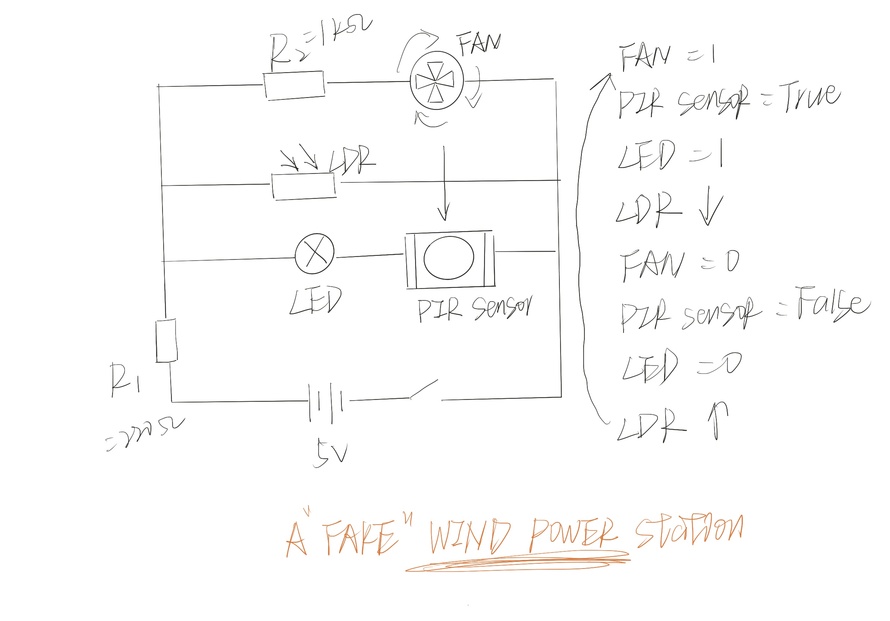
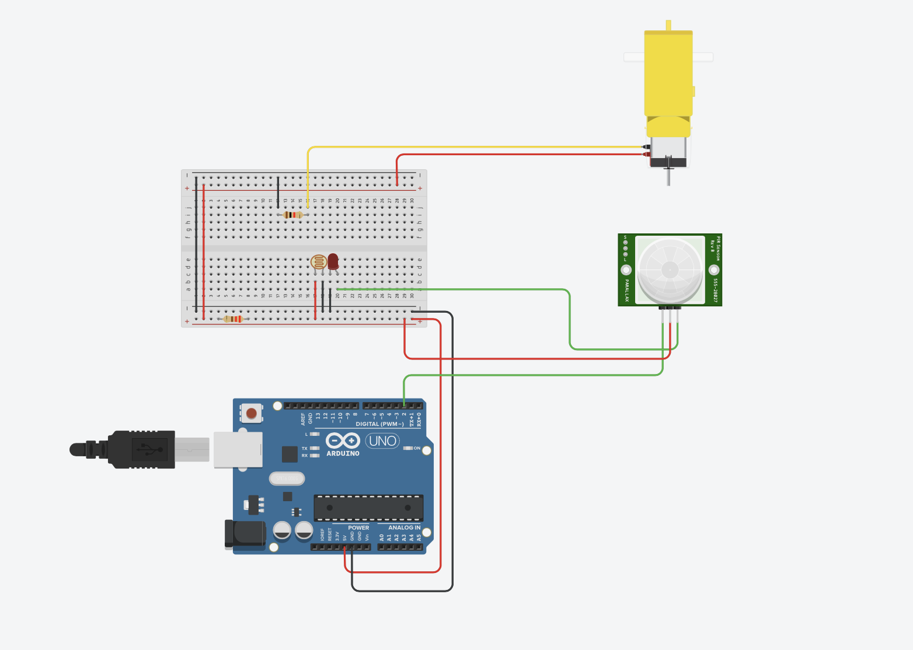

#This is a simple Feedback System trying to mimic the principle of the wind power installation.

Three branches would display in parallel and connecting to become a circuit.

branch 1: A LED and a PIR sensor.

branch 2: A LDR that might be affected by the light of the LED.

branch 3: A resistor and a Fan based on a motor, and this Fan is within the sight of the PIR sensor.

##The Process

When the circuit complete, the Fan would swivel, and the PIR sensor would receive the motion of the Fan.

Then the PIR sensor would instruct the LED to 'HIGH' via arduino code.

The LDR would go down with the lighting of the LED.

Then the branch 3 would cease for the current maily go through branch 2, thus the Fan stop.

When Fan stop, the PIR sensor would no longer give instruction to the LED, so that the LDR would go up again.

Then the Fan would operate again...

##Simple circuit sketch

##Connection in TinkerCad (because there is no Fan in the TinkerCad, So I just use a motor as presentation)

Although it seems that it is the Fan create power and trigger the LED to high, it just a trick using the phototransistor.
So I call it a 'FAKE' Fan power installation.

Next I would find a true Fsn motor to finish this mini project.

