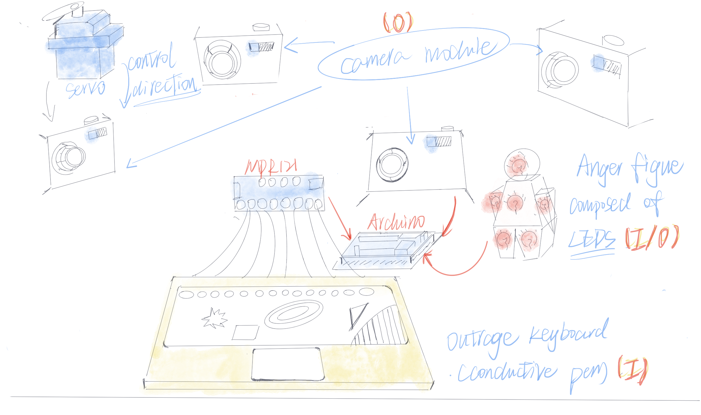

# Focus
I was inspired by the phenomenon that on the social media, angry words, hate speech, as well as promoting incendiary, controversial, or polarizing content 
are more likely to occupy the sight of the audiences. Because that the algorithm of those companies like Facebook and Youtube are designed to be profit-centered,
they use this way to raise more attentions from the users. 
the report link: [Angry by design: toxic communication and technical architectures](https://www.nature.com/articles/s41599-020-00550-7)

**So I would like to make an ironic installation to embody this kind of 'Focus'.**
Because most of the people(including me) might have Lens phobia to some degree, especailly at the time they are not 'decent'. so I designed an 'anger keyboard', 
all the content on the keyboard is about some negative speeches. When triggerring it, a bulb figure would be lit up, just like the mechanism in a battle video game, 

the player need to hit the rival and collect the rage point, which might feedback as the power. 

At the same time, the camera would rotate to the input direction. 
when all the bulbs illuminate, the camera would give a sound of 'shot', then the lighting figure goes out.

## the whole sketch shows below:

## I/O
### Input                                 output

touch-MPR121                               LEDs

People come close-ultrosonic         servo-camera module
