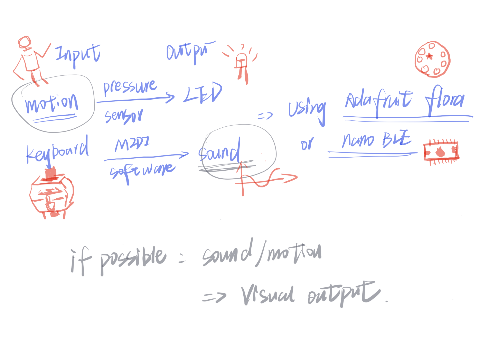
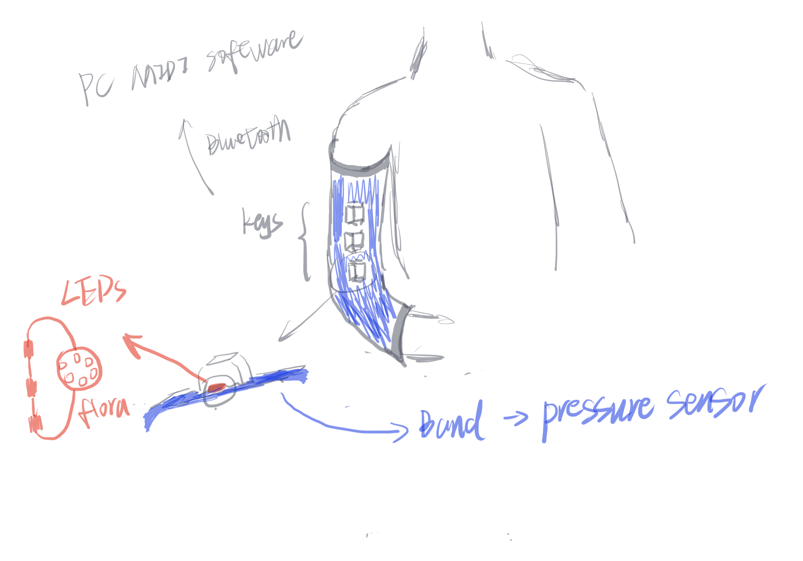
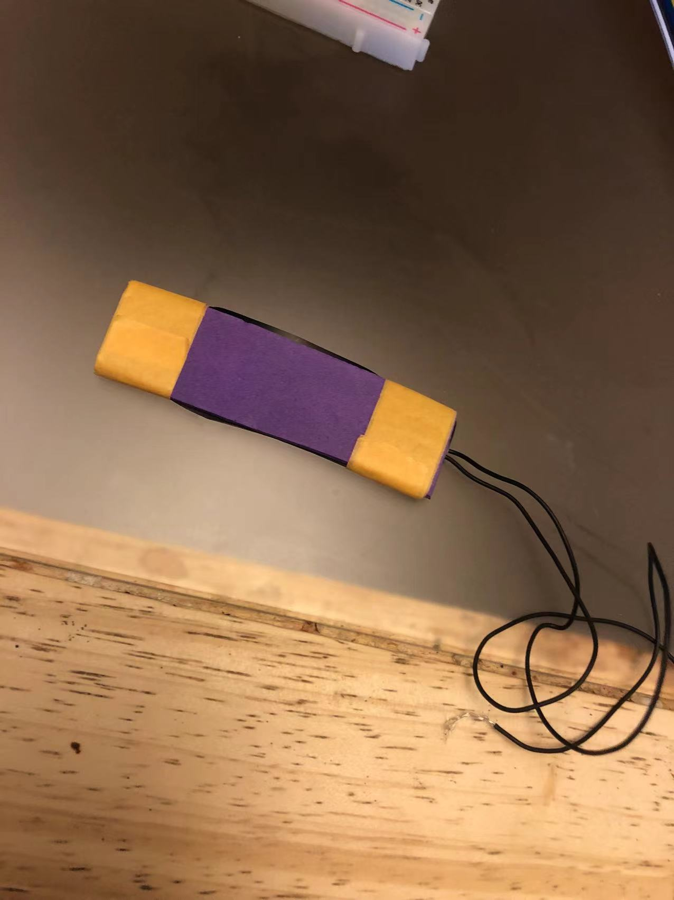
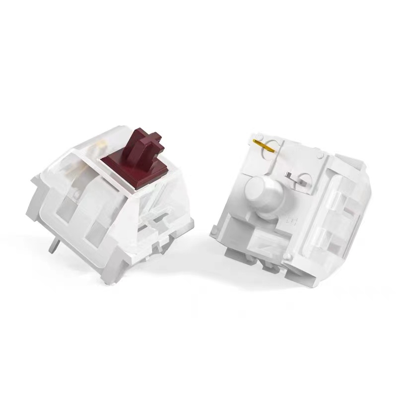

# A Wearable MIDI Controller

# Dancing Lights Review

https://www.instagram.com/p/CQZm44Zhute/?utm_medium=copy_link

This is a lighting boards that I use the *Posenet* to capture the position of the hand via webcam, then output to the lights, which are divided into 3 groups. And the height of the hand would trigger corresponding group of lights.

So the main input medium is the webcam, and the output is the LEDs.

# Now I want to upgrade it: 

 

* make this installation wearable. ( using inductive thread to sew those components together)
* It might trigger the LED via pressure sensor which wear on people’s Joint. ( similar to the one we made in class)

* Using the mechanical keys (maybe using the cap sensor is more cool?) to connect to my micro:controller( might be nano or Adafruit floral), and then connect to the computer MIDI software ( might be Ableton Live https://www.ableton.com/en/ ), each key has an output sound in the library of the software.

* (If possible) use the webcam to generate some visual output  based on sound/motions.

That is, you could compose the music while dancing to the lights.
