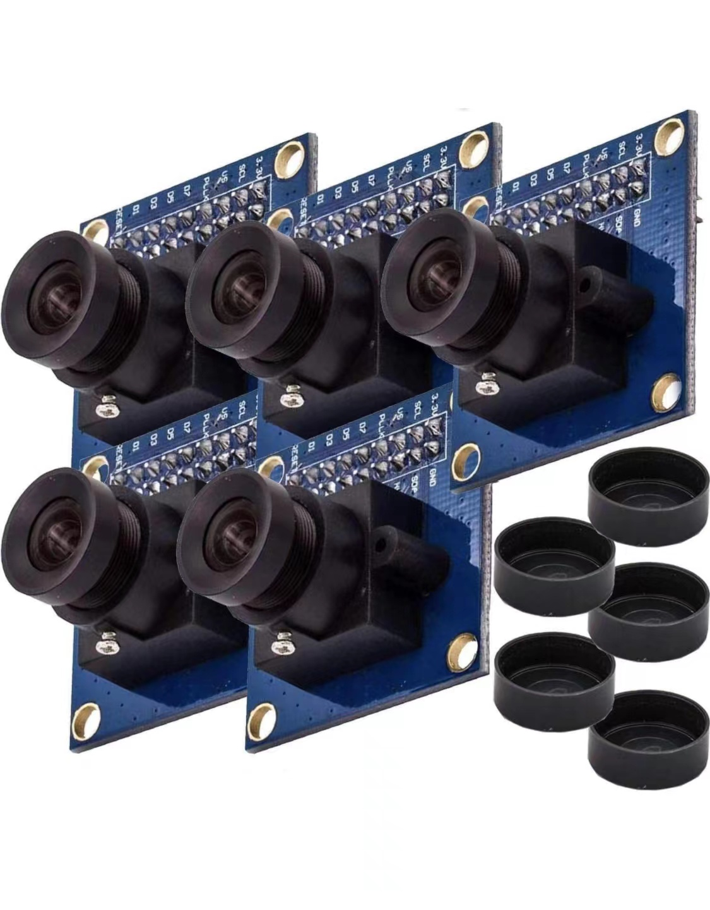
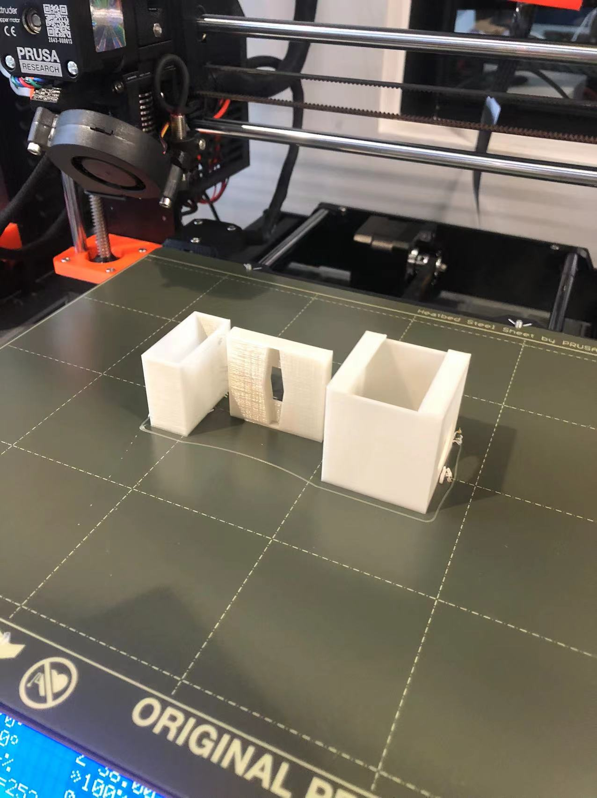
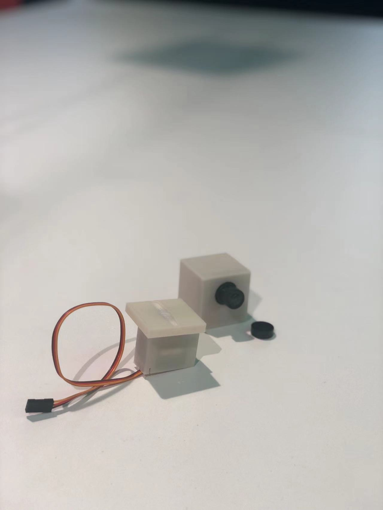
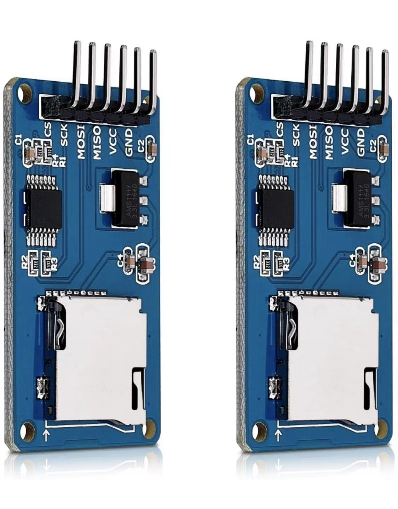

# Camera Simulatiom
To give people pressure of under supervised, as a lens phobia people, I think a bunch of lenses might have the power to create this kind of atmosphere.
so I turned to amazon to find if there is anything like camera modules that I could use.
because in this stage, I do not want to use its function, so I got these pretty cheap ones:

## 3d printing the modle
I talk with Matt about my camera simulation, and then I book a 3d printer tutorial with him.
Before tutorial, I was recommended by Matt to use the tinkercad to finish my model:

Then I get my first 3d printing camera models:

after assembly them together, and it is perfectlr fitted, and then I began to test it with codes:
[Test the servo with codes](https://youtube.com/shorts/uChRyiTW_cw?feature=share)

## Adding a sound
simulate the camera by the lens is only my first step.
In my thoughts,
**When the things work for once, people might regard it like an automatic mechine, but when they have further movement out of blue, they might be felt as 'alive'**
so, to make my camera 'alive' I think adjust another layer of sensory is necessary, so I want to add the sound in to my project.

Refer to the limitation of tone(), we can only got the buzzer sound. I want to make my camera more like a 'camera'. 
So I want to use a real 'shot' sound in my project. Then I have no choice but to add an additional SD module to preserve the sound.

Then I am trying to combine them together:

