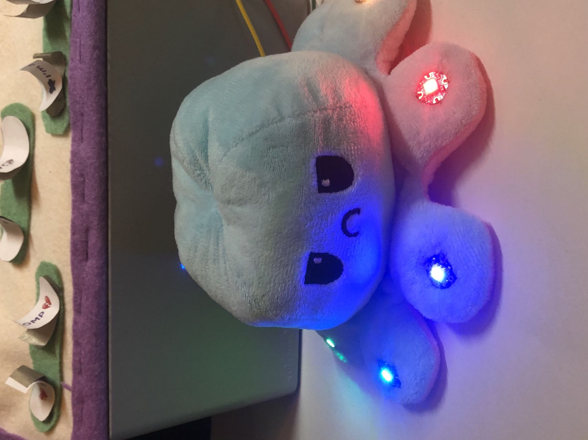
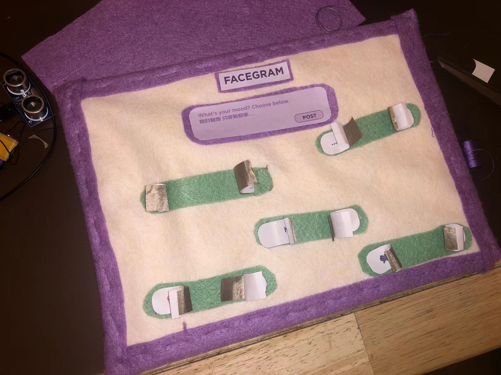
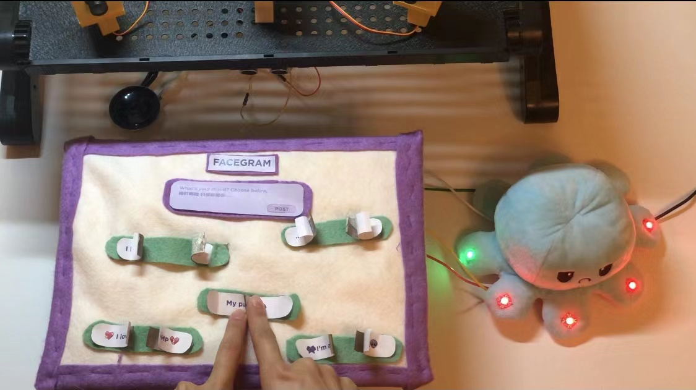
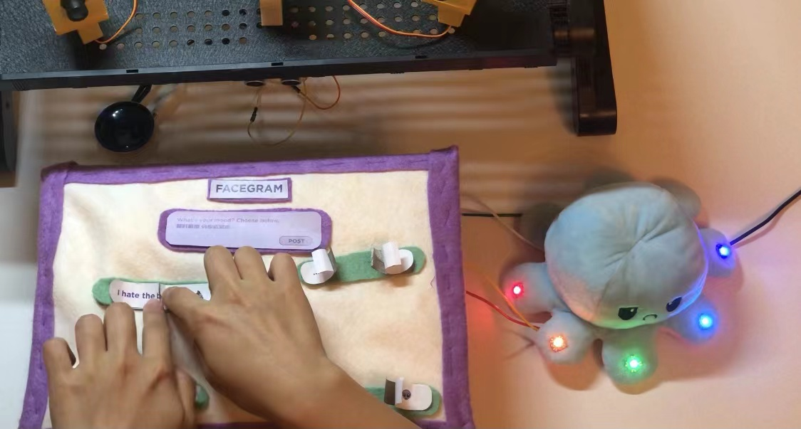

# Adding another micro controller
considering my leonardo boards are occupied by three servos, three LEDs, SD modules, speaker and ultrosonic disdance sensor.
I might need another stuff to display teh variation in my feedback figure.
I once viewed the exhibition from Lucy Sparrow, who use the cloth, thread and all the nostalgia things to make those colorful stuff from grocery stores.
The feeling of touch those 'fake' goods is hilarious, in both estranged and familiar way.
So I might possible use these kind of materials to make my interface as well as the figure.
These nostalgia is also a way to defy the high-end technology, and how they turn us to a dark side.

## Sewing things together.
when I got this grumpy octupus, I though I could make some variation to its feet, to become a cyborg octupus.
and then I think the sewable Adafruit flora and neopixel might be a good choice to do so. (due to the back side of the octupus is not easy to sew, I redo this step
for three times QAQ)

Then I refer to the neopixel library, to test if those LEDs could shine as I want.

## Find ways to trigger the Neopixel
At first, I also want to use the CapSensor on flora to control the Neopixel.
But when I followed the aged tutorial on Adafruit website, I failed to realise and also the resources of the cap library are limited.
So I decided to find another way as the trigger.

Then I thought I could design a manual switch for user. Only by fold the switch together, can they see the post content as well as the state of
Neopixel.

## sewing the interface
here comes the step to sew the interface together. I mimic the webpage style and also give it a tricky name: *Facegram*

Then I use it to connect to my flora as well as the Grumpy Octupus, which works soundly.
(but I also think maybe position the neoPixel on the interface might make it more integrated)

