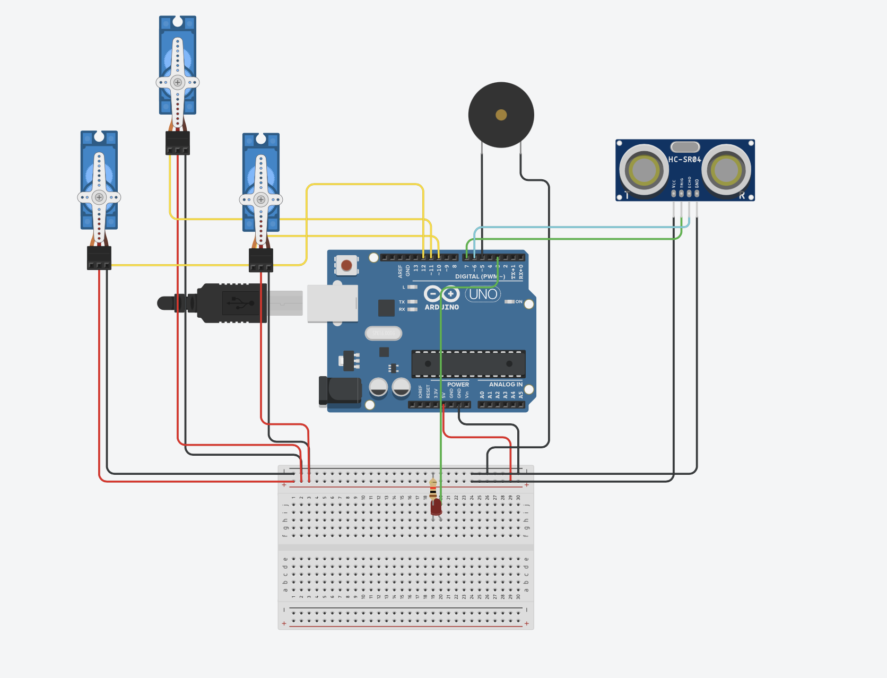
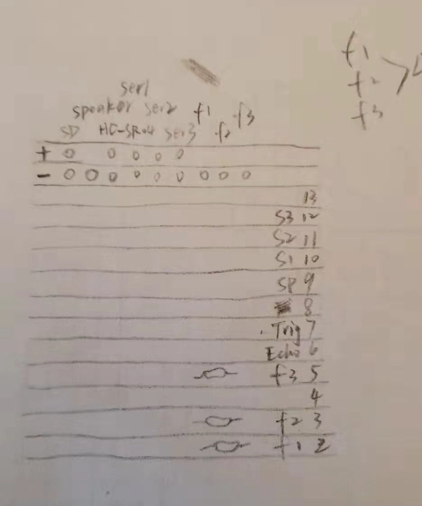
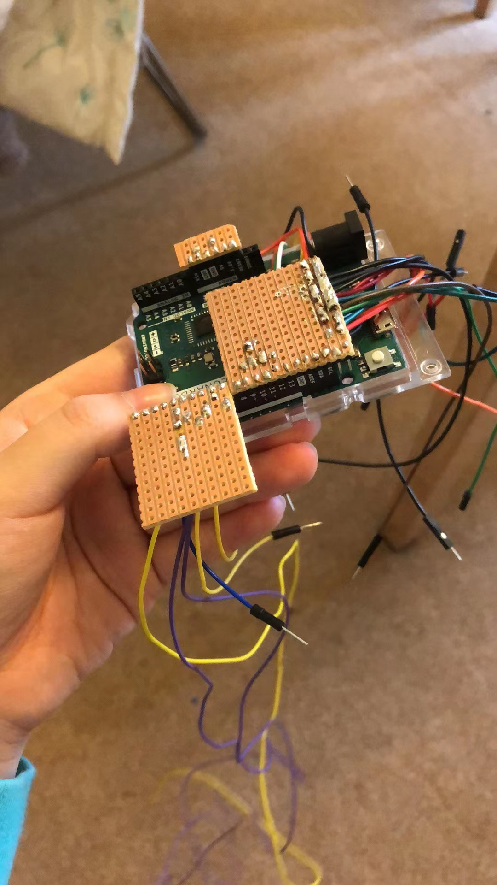
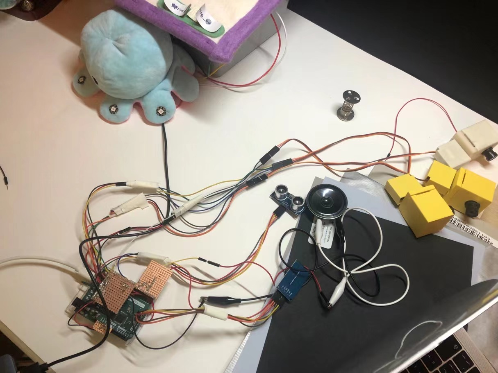
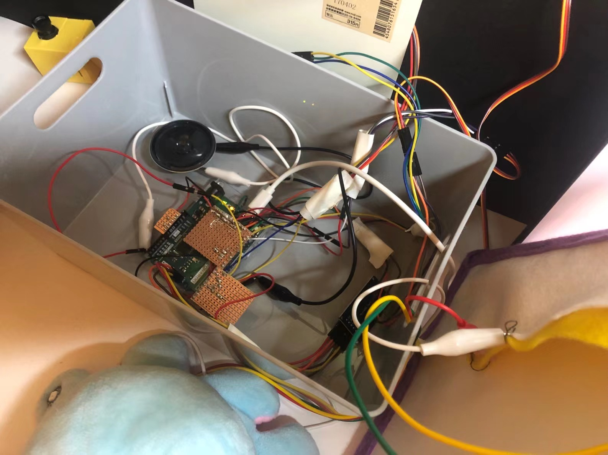
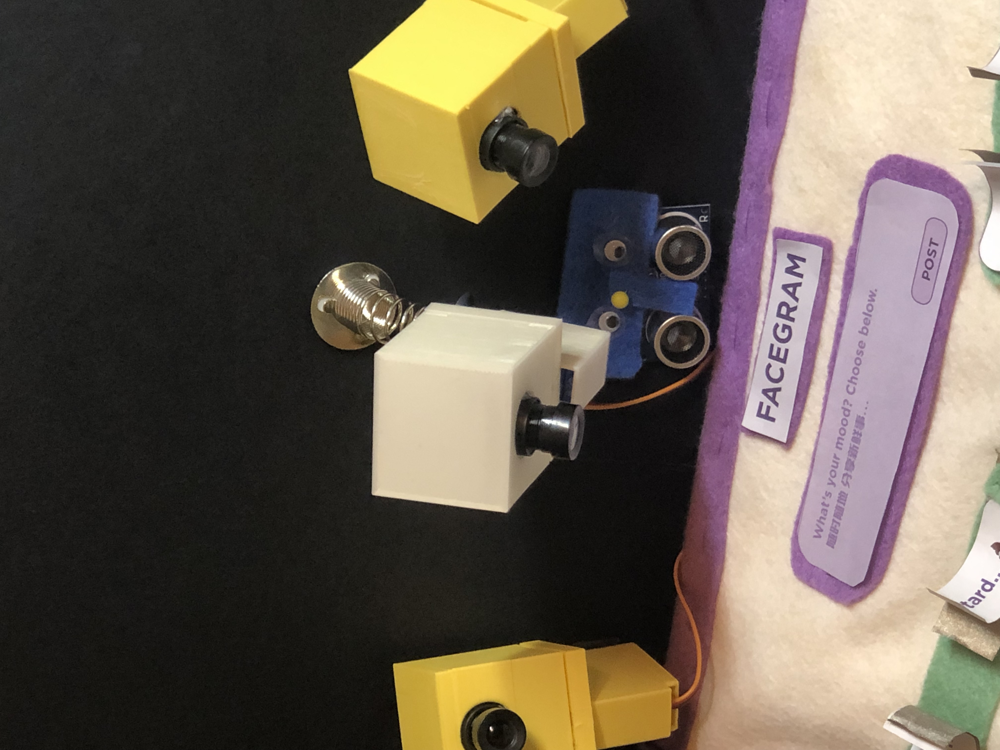
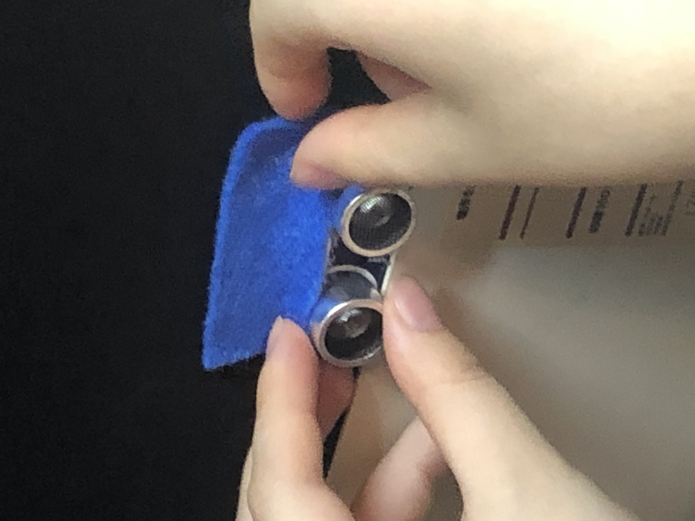
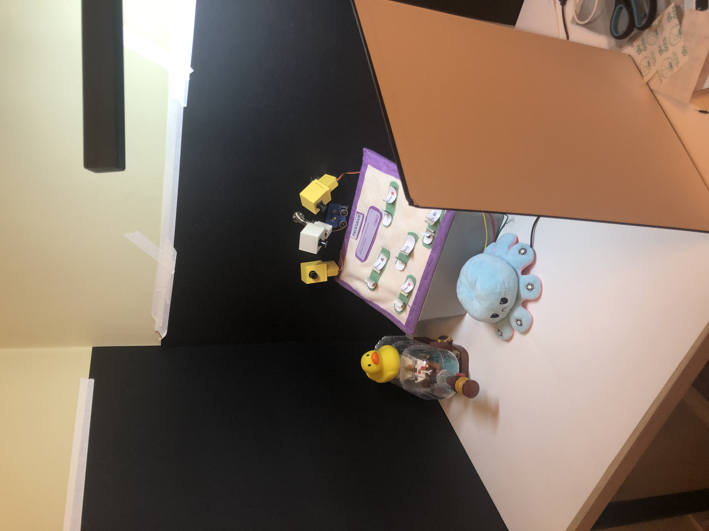

# Firstly, let's go through a final record:

# Soldering

I put my circuit into tinkerCAD: [tinkerCadLInk](https://www.tinkercad.com/things/lRiGH5WuSrO-camerasimulation/editel)

I also draw down on paper to think about how to solder my board:

Then I begin to solder it on hand:

## Allocate all the wires, house them, connect them and test

# Bug
when I assembly them together, what I am worried is happened:
The spaker cannot read the SD and play the audio, as long as the servo works. These do happen before I solder my board, but I managed to get a successful one.
However, it seems that it is not stable at all.

They could work separately, so it cannot be the problem of the circuit.
But I also follow the step on the internet, to move spaker from Pin 9 to Pin 5, in this way to be far away from the servos. as both of them miht use the PWM, 
and could bother each other. But useless.

## Writing based on PWM instead of using <servo.h>
it is said that the <servo.h> library might affect the process of Serial port to read value.
So I tried to send PWM to the servo by hand, as the codes shows in **PWMtoServo.ino**
But it does not work.

After try and try, I grasp a moment to record my final video, but the mystry in it is still waiting for me to explore....

# Final Record

Anyway, the last moment comes, assemble them all together, and to record a whole process of it:

