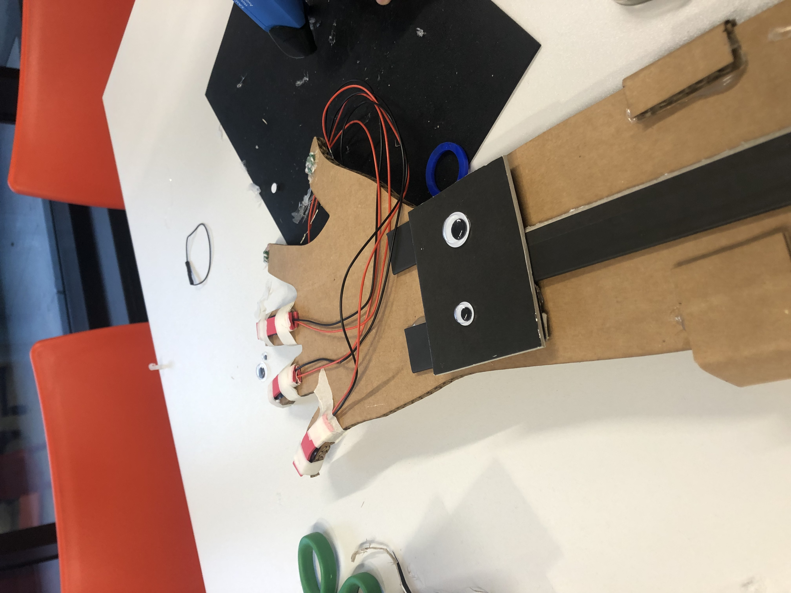
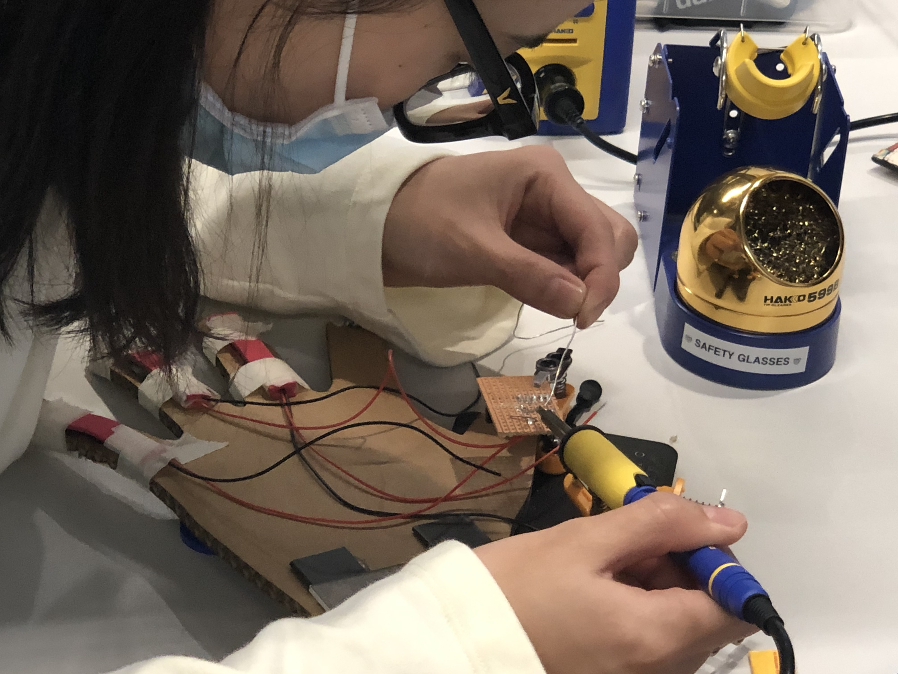

# A musical Robot Hand.

## Also a link to the final video: [RobotHand](https://youtube.com/shorts/c369v9hEVwM?feature=share)
This is my team work outcome with Jasper, Lexin, Xixuan, Jiayu and Haochen.

Follwing the step given[steps](https://photos.google.com/share/AF1QipN9Fpz8oZm9koTvDNeNdtqA_49Q0f5DY6WIU7piGU8nM_7gcSWizUO5vi1XG0sLJQ?key=ZWwxMmVIcFpxX3h1ZGphNWRwSDhWTEJVNHMzZ0d3), we collaborate to prototype, soldering and writing the codes.

## Prototyoe
when making the hand, we encounter a problem that our hand get a 'bone' fracture on the wrist, so it becomes hard for us to pull the finger rings,
so we need to do a surgury for the hand, and finally, it becomes this way (another way it becomes a cyborg hand with Robot face..haha..)

## solder

## coding
to give different fingers different tones, and make them have sound separately, we refer to some other librarie.
