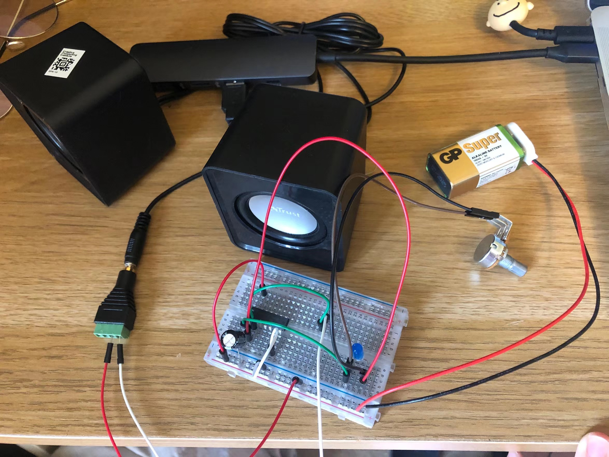

# LAb01

Following the steps given, I've finish the basic synths, and I replace the normal resisitor for a potentiometer, so that I could hear the variation in frequency,
I also add a LED to visualise the frequency:

Then I try to find other resisitor, it seems the mandarin is a bit large resistor with low-frequency sound:

# LAB02

In this part, I am tryong to make more variation to the synths.
## Firstly, I add another oscillator to the sound(also a light signal):

 
## Then I connect another pin of potentiometer, so that I create a higher pitch:

